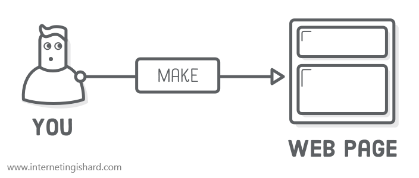
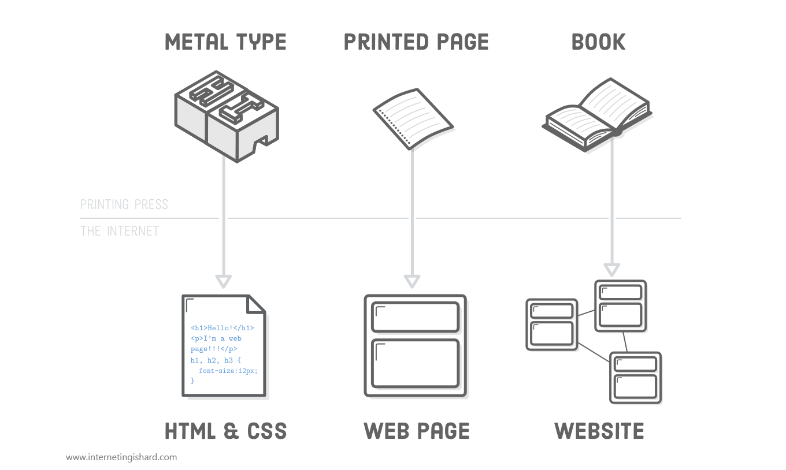
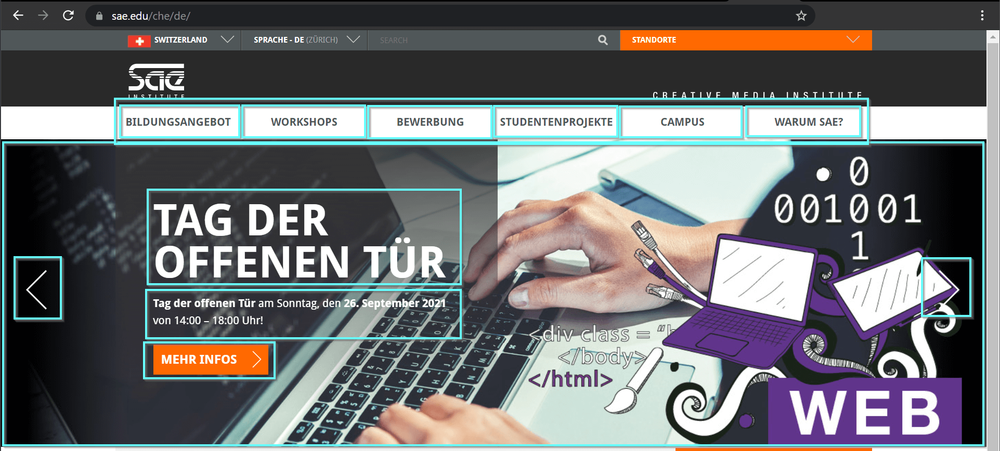
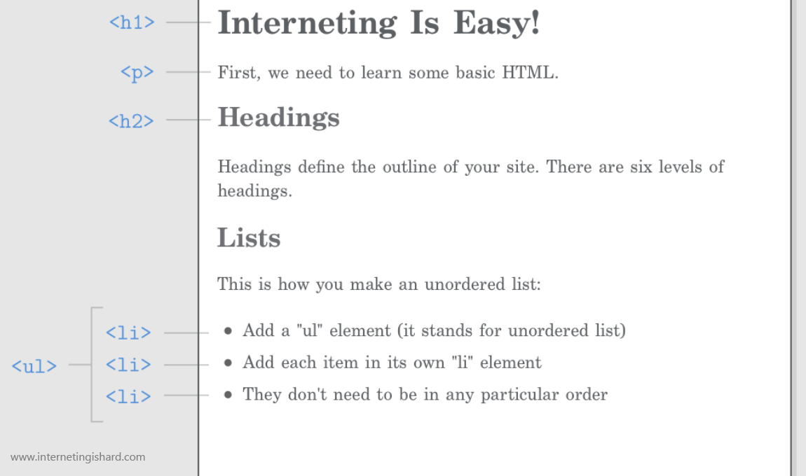

# Webentwicklung

Simon Jäger

---



Note: Kurze Vorstellungsrunde (Name, Vorkenntnisse, Erwartungen)

---

## HTTP

http(s)://<br>
domain.ch<br>
/subfolder<br>
/page.html

→ Dateien von einem *anderen* PC (Server)

---

<iframe width="560" height="315" src="https://www.youtube.com/embed/oJ8NzLGMrSA" title="YouTube video player" frameborder="0" allow="accelerometer; autoplay; clipboard-write; encrypted-media; gyroscope; picture-in-picture" allowfullscreen></iframe>

---



---



---

```html
<h1>Hypertext Markup Language</h1>
<p>Die Code-Sprache des Web</p>
```

```html
<tag>Auszuzeichnender Text</tag>
```

---



---

<iframe width="560" height="315" src="https://www.youtube.com/embed/xKuJrmlCdig" title="YouTube video player" frameborder="0" allow="accelerometer; autoplay; clipboard-write; encrypted-media; gyroscope; picture-in-picture" allowfullscreen></iframe>

<iframe width="560" height="315" src="https://www.youtube.com/embed/rOPKC49gTkk" title="YouTube video player" frameborder="0" allow="accelerometer; autoplay; clipboard-write; encrypted-media; gyroscope; picture-in-picture" allowfullscreen></iframe>

---

## Browser

https://www.google.com/chrome

Note: Verbreitetster Browser, Dev-Tools

---

## Code-Editor

https://code.visualstudio.com

Note: Installieren, Basics (Dateien, Editor, Highlighting, ...), Plugin: Live Server, Auto-Save, Emmet, Beispiel
