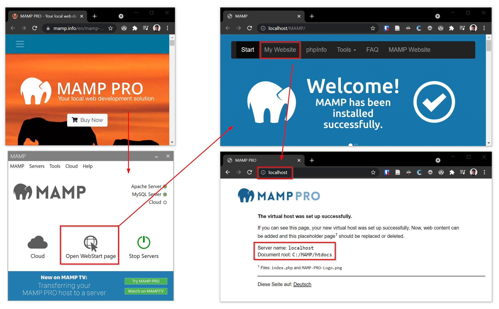

- Installiere einen lokalen PHP-Server: https://www.mamp.info
- Lege eine Datei `index.php` in deinem Root an (z. B. C:/MAMP/htdocs/index.php)
- Schreibe folgenden Inhalt in die Datei: `<?php phpinfo();`
- Starte MAMP und öffne deine Website, in dem du mit dem Browser auf die
  URL `localhost` navigierst
- Leider bietet MAMP keinen Live-Reload. Als Alternative kannst du die
  Chrome-Extension [Auto Refresh Plus](https://autorefresh.io/) verwenden.

