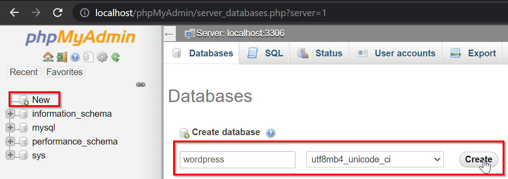
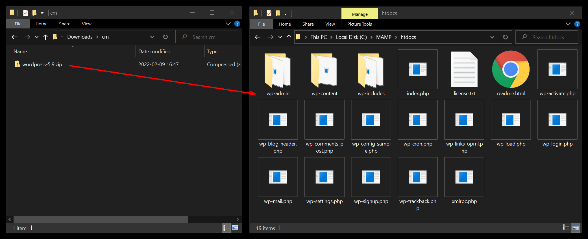
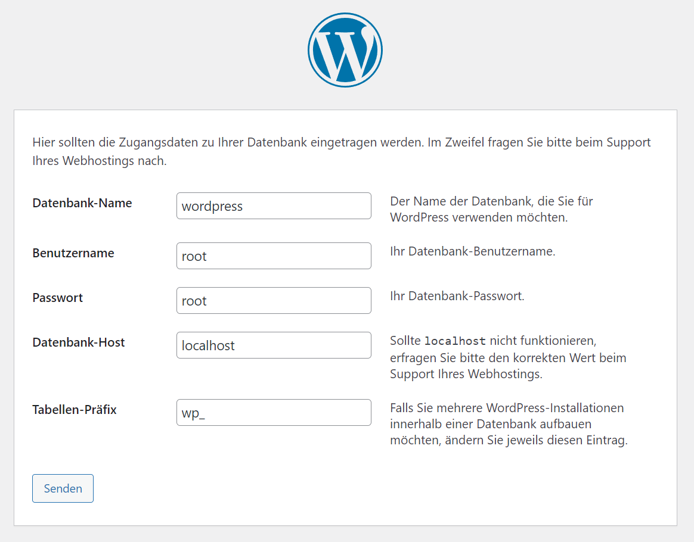

# CMS – Content Management System

Ein Inhaltsverwaltungssystem (CMS) ist ein Tool, welches das Verwalten von Inhalten erlaubt.
Diese werden dann in vordefinierte Templates eingefügt, um die effektive Website zu rendern.
Die meisten CMS laufen direkt im Browser, und werden quasi neben der eigentlichen Website hochgeladen und mit einem Passwort geschützt.

## Datenbanken

Ein CMS speichert Daten, wie etwa Blog-Posts oder Produktinfos, in einer Datenbank.
MySQL ist eine der verbreitetsten Datenbanksystem und ist in MAMP vorinstalliert.
Navigiere mit dem Browser auf `http://localhost/phpMyAdmin` für ein grafisches Interface zur MySQL-Datenbank.
Kreiere dort eine Datenbank für ein CMS mit dem Namen `wordpress` und dem Zeichensatz `utf8mb4_unicode_ci`.

## WordPress

> 42% of the web uses WordPress, from hobby blogs to the biggest news sites online.

WordPress ist das meist genutzte CMS der Welt. Installieren wir es für unser Web-Projekt:

- Lade WordPress herunter: https://de-ch.wordpress.org/download/#download-install
- Extrahiere das ZIP und verschiebe den Inhalt des Ordners `wordpress` in MAMPs `htdocs`

- Navigiere mit dem Browser auf `http://localhost` um die Installation zu starten
- Der Standard-User bei MAMP hat den Names und das Passwort `root`. Bei einer Live-Website findest du solche Daten im Dashboard deines Hostinganbieters.

- Leg anschliessen einen Benutzeraccount für WordPress selbst an und logge dich ein
