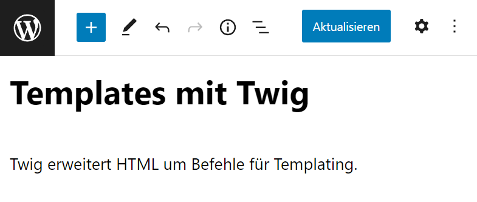

# Templates

Trennung von Inhalt und Layout

---

```html

<nav>...</nav>
<h1>Mein erster Beitrag</h1>
<p>Lorem ipsum dolor ...</p>
<footer>...</footer>
```

```html

<nav>...</nav>
<h1>Noch ein Beitrag</h1>
<p>Amet consectetur adipiscing ...</p>
<footer>...</footer>
```

---

# 😭

CTRL+C, CTRL+V

---

## Twig

HTML mit Befehlen für Templating.

---

## Variablen und Slots

```html
<h1>{{ post.title }}</h1>
<div>{{ post.content }}</div>
```

---


<div class="grid-2">
<div>

### Template

```html
<h1>{{ post.title }}</h1>
<div>{{ post.content }}</div>
```

</div>
<div>

### Inhalt



</div>
</div>

---

## Schlaufen

```html
<h1>{{ post.title }}</h1>

  <a href="{{ category.link }}">{{ category.name }}</a>

<div>{{ post.content }}</div>
```

---

## Layouts

...

---

## Includes

...

---

## WordPress-Templates

- index.twig
- single.twig
- page.twig
- archive.twig
- 404.twig

---

## Links

- https://marketplace.visualstudio.com/items?itemName=mblode.twig-language
- https://timber.github.io/docs/reference/timber-post/
- https://twig.symfony.com/doc/3.x/templates.html

---

## WP-Blank

https://github.com/simon-jaeger/wp-blank/releases
